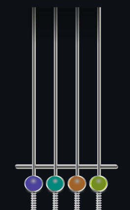

# Corners Distortion Shader

This is a small Unity shader that distorts the top and bottom corners of the screen, similar to the Photoshop distortion tool. Additionally, it allows for opacity adjustments, creating a "Fade" effect from top to bottom, with a customizable point and adjustable height for fine-tuning.

### Features

- Distorts the top and bottom corners to create a sense of depth.
- Allows opacity adjustments for a gradual fade effect.
- Includes a C# controller for easy usage without needing to modify materials or shader code directly.

### Use Case

This shader was developed to solve a challenge in an AdverGame similar to "Clone Hero." The game was originally designed to be completely vertical, which wasn’t an issue until the client requested to add depth, as seen in the "Guitar Hero" series.

The game code was built entirely around a vertical setup, and rewriting everything would have been time-consuming. To address this quickly and efficiently, I came up with a camera filter that distorted the image, simulating depth without needing to alter the game’s core logic.

### Additional Solution

After implementing the depth distortion, a new problem arose: the "beats" would suddenly appear on screen. To mimic how these elements gradually fade in as in the original games, I added a second filter on top of the shader that applies a vertical fade-in effect from top to bottom. This fixed the issue without the need to rewrite the game code.

### Why Share This Shader?

While this shader is quite specific, I found it interesting to share because it may be useful in other projects facing similar challenges. I hope this solution proves helpful for your own games and projects!

### Thanks you for read! <3
